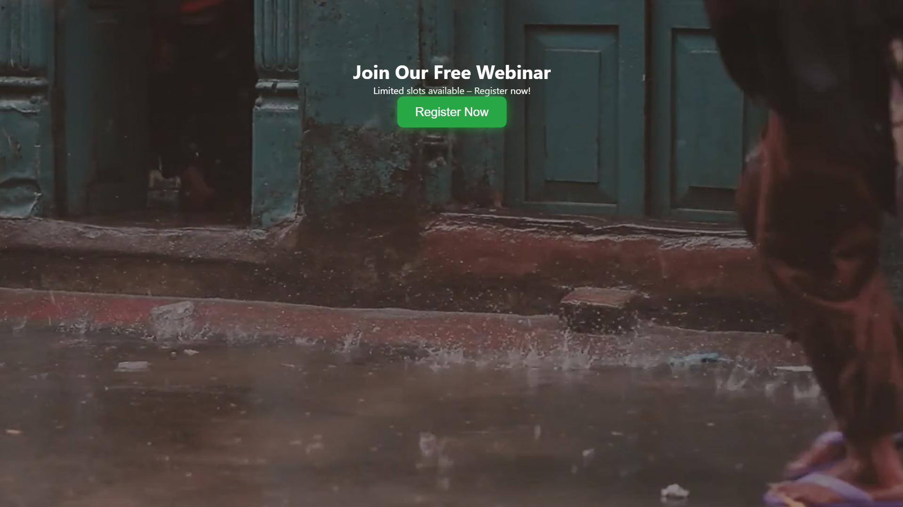
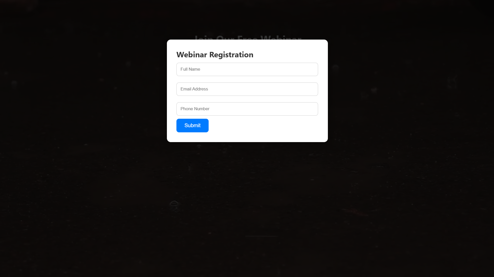
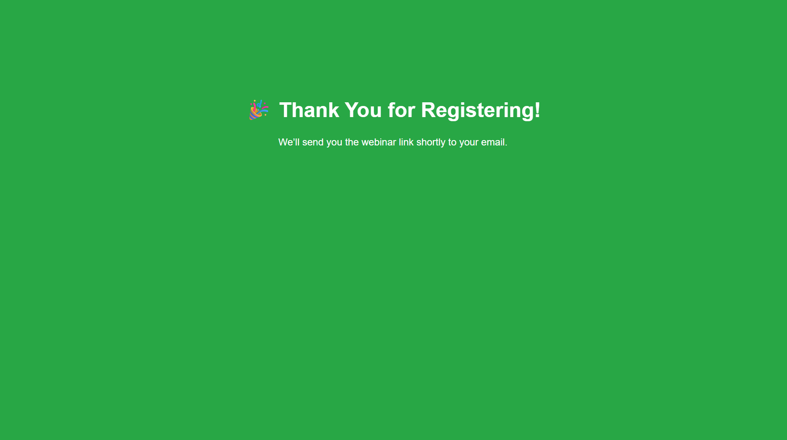

# 🎥 Webinar Registration Page

Welcome to the **Webinar Registration Page** project!  
This is a fully responsive and animated HTML form designed for webinar signups. It includes smooth animations, a video background, form validation, and auto-redirect to a custom **Thank You** page after submission.

## ✨ Features

- 📱 **Responsive Design** – Optimized for mobile, tablet, and desktop.
- 🧾 **Clean Registration Form** – Collects name, email, and other details.
- 🎬 **Video Background** – Engaging YouTube video plays behind the form.
- ✅ **Form Validation** – Prevents empty submissions.
- 🔀 **Auto Redirect** – Users are taken to a Thank You page after submitting.
- 🌐 **Hosted on GitHub Pages**

## 📸 Screenshots

### 📝 Registration Form

### ✅ Form Submitted

### 🙏 Thank You Page

## 🚀 Live Demo

🔗 [Click here to view the live page](https://github.com/mrashish18/WEBINAR-LOGIN-PAGE)

## 🛠️ How to Use

1. Clone or download this repository.
2. Open `REGISTRATION FORM.html` in any browser.
3. Customize the form fields and YouTube video URL if needed.
4. Push changes to GitHub and host it using **GitHub Pages**.

## 🤝 Contribute

Pull requests are welcome. For major changes, please open an issue first to discuss what you'd like to change.

---

### 📬 Contact

Made with ❤️ by Ashish Kumar(https://github.com/mrashish18)
